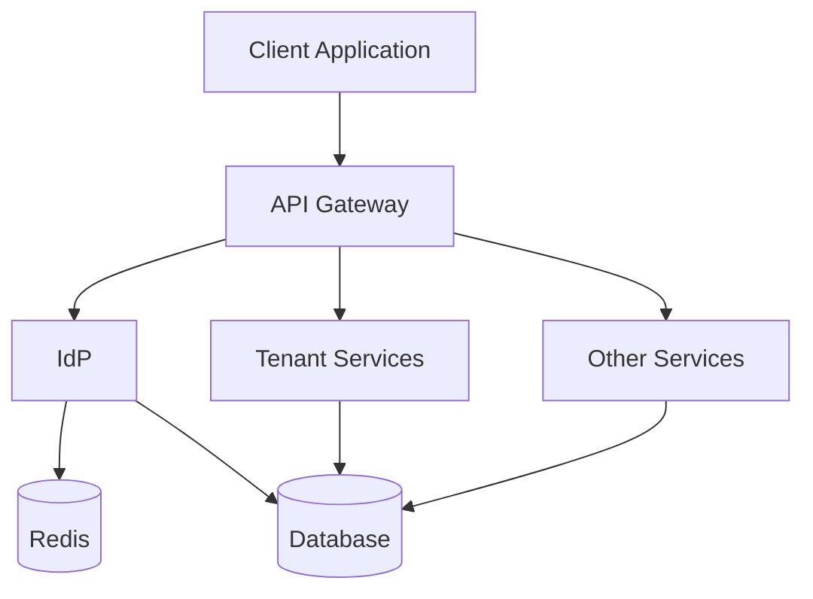

# Introducción

Este repositorio contiene un proyecto personal para afianzar conceptos de Arquitectura de software y desarrollar servicios con Go. También, se aprovechará para comenzar en el desarrollo de frontend web y mobile(ios, android). Todo ello basado en un desarrollo BDD.

## Proyecto

La idea principal es llevar a cabo la construcción de un producto SaaS que nos permita gestionar ficheros (almacenamiento, envío, control de fraude, integridad, etc).
Algunos requerimientos que debe cumplir el producto:
- Para mercados B2B y B2C
- Despliegue multiproveedor, on-cloud, on-premise o híbrido
- Separación backend y los diferentes clientes web y mobile
- Cumplimiento ENS, ISO 27001 y GDPR
- Arquitecturas límpias y código límpio.

## Arquitectura inicial

