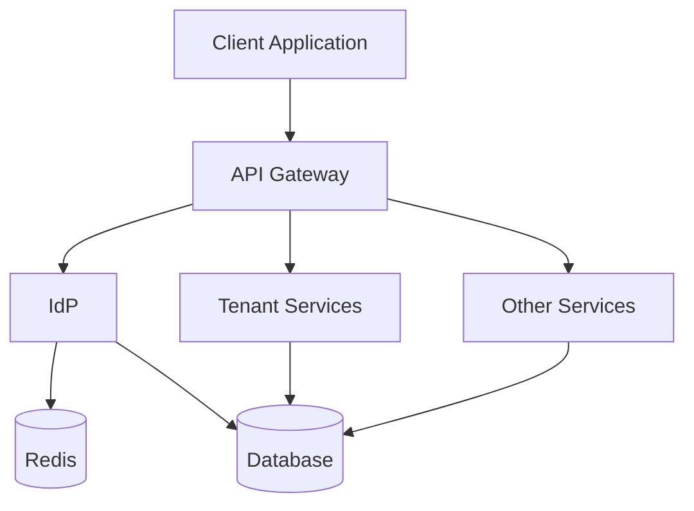

# Introducción

Este repositorio contiene un proyecto personal para afianzar conceptos de Arquitectura de software y desarrollar servicios con Go. También, se aprovechará para comenzar en el desarrollo de frontend web y mobile(ios, android). Todo ello basado en un desarrollo BDD.

## Proyecto

La idea principal es llevar a cabo la construcción de un producto SaaS que nos permita gestionar ficheros (almacenamiento, envío, control de fraude, integridad, etc).
Algunos requerimientos que debe cumplir el producto:
- Para mercados B2B y B2C
- Despliegue multiproveedor, on-cloud, on-premise o híbrido
- Separación backend y los diferentes clientes web y mobile
- Cumplimiento ENS, ISO 27001 y GDPR
- Arquitecturas límpias y código límpio.
- Framework gofr
- Comunicación entre microservicios con gRPC
- Servicios publicos y comunicación con clientes a través de api Restful

## Arquitectura inicial



## Estructura del proyecto

```
saas-file-platform/
├── backend/
│   ├── services/
│   │   ├── idp/
│   │   │   ├── cmd/
│   │   │   │   └── main.go
│   │   │   ├── internal/
│   │   │   │   ├── application/
│   │   │   │   │   ├── commands/
│   │   │   │   │   ├── queries/
│   │   │   │   │   └── services/
│   │   │   │   ├── domain/
│   │   │   │   │   ├── model/
│   │   │   │   │   ├── repository/
│   │   │   │   │   └── service/
│   │   │   │   └── infrastructure/
│   │   │   │       ├── persistence/
│   │   │   │       ├── auth/
│   │   │   │       └── api/
│   │   │   ├── config/
│   │   │   │   ├── config.go
│   │   │   │   └── config.yaml
│   │   │   ├── test/
│   │   │   ├── go.mod
│   │   │   └── go.sum
│   │   ├── tenant-service/
│   │   │   └── [estructura similar a idp]
│   │   └── api-gateway/
│   │       └── [estructura similar a idp]
├── web/
│   └── admin-panel/
├── mobile/
│   ├── android/
│   └── ios/
├── go.work
├── go.work.sum
├── docker-compose.yml
├── docker-compose.dev.yml
└── README.md
```

# Funcionalidades

## IDP Service Responsibilities
User Authentication & Authorization
- User registration and login
- Password management
- Multi-factor authentication (2FA)
- OAuth2/OIDC integration
- Session management
- JWT token management
Role & Permission Management
- RBAC (Role-Based Access Control)
- Permission assignment
- Access control validation
User Management
- User profile CRUD
- User status management (active/inactive)
- Password reset/recovery
Security & Audit
- Authentication logging
- Security event tracking
- Failed login attempts
- Password change history
